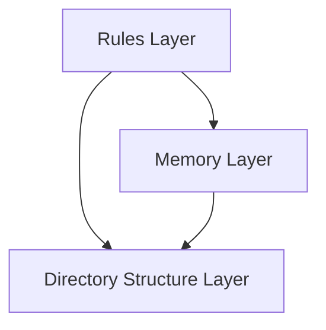
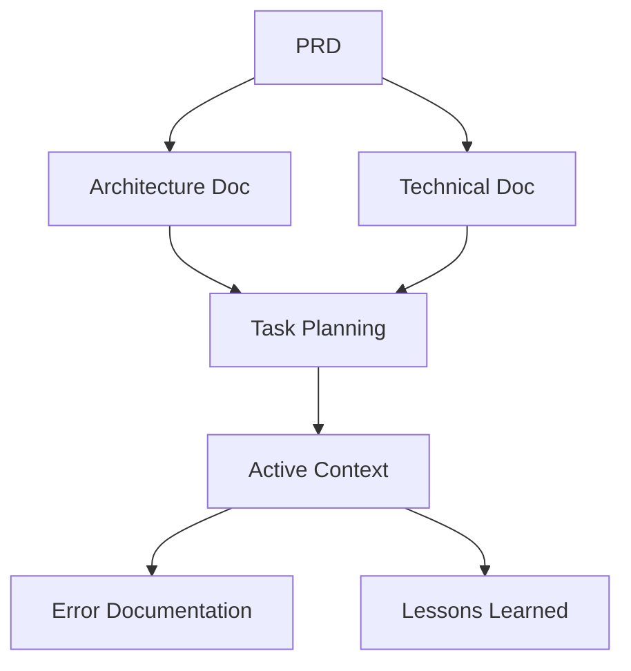
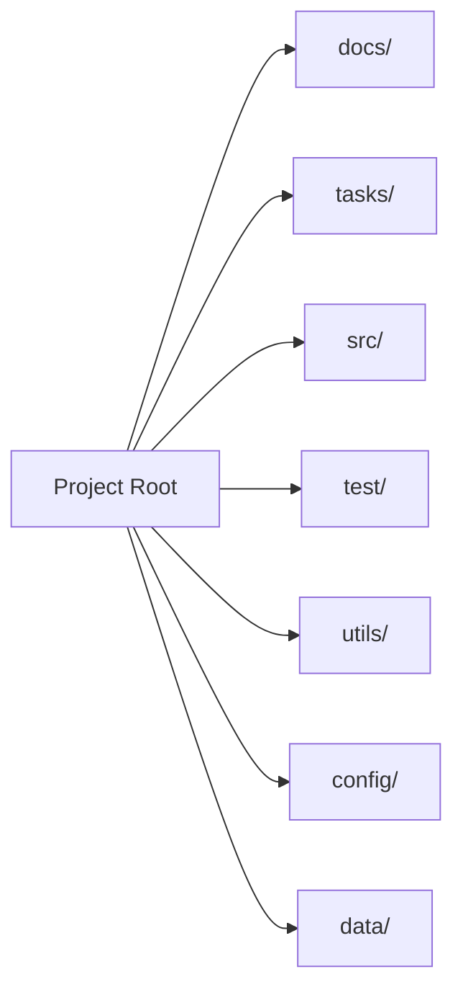
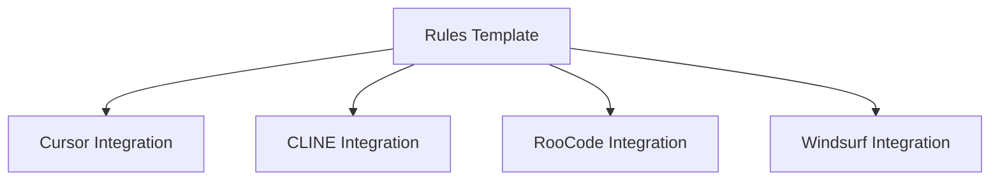

# System Architecture

## High-Level Architecture

### System Overview
The Rules Template system is structured as a layered architecture with the following key components:

## Component Architecture

### 1. Rules Layer
The rules layer manages the core functionality and workflows:

#### Custom Mode Management
- Chat Mode (Minimal context, pure LLM interaction)
- Write Mode (File operations, command execution)
- MCP Mode (Model Context Protocol integration)

#### Workflow Engines
- Planning Engine (Requirements analysis, solution design)
- Implementation Engine (Code execution, testing)
- Debug Engine (Error resolution, optimization)

### 2. Memory Layer

#### Documentation Management

#### Context Management
- Persistent Storage System
- Auto-update Mechanisms
- Cross-platform Synchronization

### 3. Directory Structure Layer

#### Core Directories

## Integration Architecture

### Platform Integration

### File Synchronization
- Symbolic Link Management
- Cross-platform Compatibility Layer
- Version Control Integration

## Security Architecture

### Access Control
- File Permission Management
- Platform-specific Security Controls
- Documentation Access Controls

### Data Protection
- Version Control Integration
- Backup Management
- Change Tracking

## Performance Considerations

### Token Optimization
- Custom Mode Selection
- Context Loading Optimization
- Memory Management Strategies

### Response Time
- File Operation Optimization
- Command Execution Management
- Documentation Update Efficiency

## System Requirements

### Development Environment
- IDE Integration Support
- Multi-platform Compatibility
- Version Control System Integration

### Runtime Requirements
- Minimal System Resources
- Cross-platform Support
- Standard Development Tools

## Future Architecture Considerations

### Scalability
- Support for Additional AI Platforms
- Enhanced Documentation Systems
- Improved Context Management

### Extensibility
- Plugin Architecture
- Custom Rule Integration
- Third-party Tool Integration

## Architecture Decision Records

### ADR-001: Custom Mode Implementation
- Decision: Implement separate modes for different operations
- Status: Approved
- Context: Need to optimize token usage and operation efficiency
- Consequences: Improved performance, clear separation of concerns

### ADR-002: Memory Layer Design
- Decision: Hierarchical documentation structure
- Status: Approved
- Context: Need for organized, accessible project knowledge
- Consequences: Better context management, improved documentation maintenance
